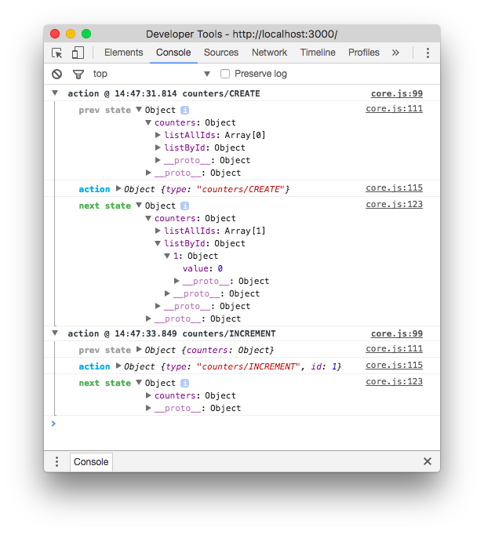

Trying out the React stack
==========================
My personal playground of react, redux, sagas, selectors and
more fun stuff!

Notes
-----
Dan Abramov's video series [Getting Started with Redux](https://egghead.io/courses/getting-started-with-redux),
is a great starting point on your Redux journey.

Interesting article series from Jack Hsu, regarding structure
of Redux application. [Three Rules For Structuring (Redux)
Applications](https://jaysoo.ca/2016/02/28/organizing-redux-application/)

### Bumps in the road
Soon enough I ended up with a nested store, and my reducer
looked like shit.

```javascript
const counterList = (state = [], action) => {
  switch (action.type) {
    case 'CREATE':
      return [
        ...state,
        {
          id: state.length,
          value: 0,
        }
      ]
    case 'DESTROY':
      return [...state.slice(0, state.length - 1)]
    case 'INCREMENT':
      return [ ...state.slice(0, action.id),
        {
          id: action.id,
          value: state[action.id].value + 1,
        },
        ...state.slice(action.id+1)
      ]
    .
    .
    .
    default:
      return state
  }
}
```

By normalizing state as described in
[Normalizing State Shape](http://redux.js.org/docs/recipes/reducers/NormalizingStateShape.html)
of the Redux docs, you end up with simpler reducers.

```javascript
import { combineReducers } from 'redux'
import _ from 'lodash'

const allIds = (state = [], action) => {
  switch (action.type) {
    case 'CREATE':
      return state.concat(state.length+1)
    case 'DESTROY':
      return state.slice(0, state.length-1)
    default:
      return state
  }
}

const objectLength = o => {
  if (o) return Object.keys(o).length
  else   return 0
}

const byId = (state = {}, action) => {
  switch (action.type) {
    case 'CREATE':
      return {
        ...state,
        [objectLength(state)+1]: {
          value: 0
        }
      }
    case 'DESTROY':
      return _.omit(state, objectLength(state))
    case 'INCREMENT':
      return {
        ...state,
        [action.id]: {
          value: state[action.id].value + 1
        }
      }
    .
    .
    .
    default:
      return state
  }
}

const counter = combineReducers({
  listAllIds: allIds,
  listById: byId,
})
```

Ending up with a store which looks like:

```json
{
  "counters": {
    "listAllIds": [ 1, 2 ],
    "listById": {
      "1": { "value": 42 },
      "2": { "value": -1 }
    }
  }
}
```

When working with deeply nested data structures, the
[normalizr](https://github.com/paularmstrong/normalizr)
library is good for parsing complicated data (i.e. 
data received from an API call to the back-end).

Yes, we need to be just as mindful with normalizations
and the structure of data, as when designing relational
databases on the back-end.

### Pls let me view state changes
Logging to the rescue!



We use the middleware package redux-logger.

```javascript
import { createStore, applyMiddleware } from 'redux'
import createLogger from 'redux-logger'
import rootReducer from './rootReducer'

const logger = createLogger()
const store = createStore(
  rootReducer,
  window.__REDUX_DEVTOOLS_EXTENSION__ && window.__REDUX_DEVTOOLS_EXTENSION__(),
  applyMiddleware(logger)
)

render(
  <Provider store={store}>
    ...
  </Provider>,
  document.getElementById('root')
)
```
